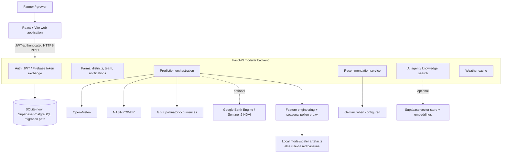
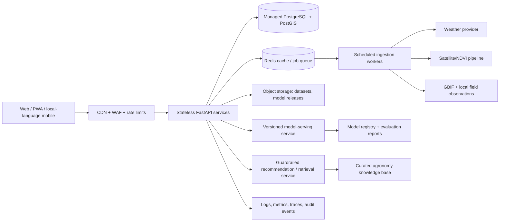

# PolliSync — Demo Submission Brief

**Tagline:** *Turning scattered environmental signals into pollination-safe actions for farmers.*

**Track fit:** Hack4Humanity / AI for Societal Good. PolliSync helps a grower understand when local weather, crop health, flowering timing, and available pollinator evidence make pollination favourable or risky. Instead of showing a generic forecast, it translates those signals into a farm-specific Pollination Suitability Index (PSI), flowering window, and practical next action.

> **Submission integrity note.** This document distinguishes **implemented in the current repository**, **demo-mode behaviour**, and **next-phase work**. Do not present planned integrations, mock data, or unavailable model artefacts as live production capabilities.

---

## 1. Executive summary

PolliSync is a web application for crop-pollination decision support, initially focused on Maharashtra. A grower creates a farm profile, selects a crop and location, runs a prediction, and receives a dashboard containing:

- a PSI score from 0 to 100 and a Low/Medium/High risk label;
- a predicted flowering window and confidence value;
- weather, seasonal pollen, NDVI, and pollinator context;
- a generated or deterministic agronomic recommendation;
- farm, prediction-history, notification, and team-management views; and
- an authenticated AI-assistant interface.

The core human outcome is earlier, clearer action: protect pollinator activity, schedule sprays outside active pollination periods, monitor moisture and wind, and prepare for the predicted flowering window. It is **decision support**, not a replacement for a local agronomist or a guarantee of yield.

## 2. Current build: confirmed implementation status

| Capability | Current status | Evidence / limitation |
| --- | --- | --- |
| Responsive web product | Implemented | React 18 + Vite frontend with landing, login, onboarding, farm, prediction, dashboard, analytics, settings, support, notifications, and chat routes. |
| Authentication | Implemented with two paths | Backend supports JWT registration/login/refresh and Firebase-token exchange. Production identity-provider configuration still needs verification. |
| Farm persistence | Implemented | FastAPI + SQLAlchemy; local SQLite is the active configured database. Supabase schema/migration support is present but not the current default runtime. |
| Weather | Implemented with fallback | Open-Meteo current/forecast fetch and one-hour cache. Prediction environment service also calls NASA POWER for a seven-day feature set. If upstream calls fail, static fallback values keep the flow running. |
| Pollinator data | Partially live | GBIF occurrence queries power the map / richness signal where records exist. The displayed species list can fall back to crop-based mock species. GBIF sparsity must be disclosed. |
| Pollen | Proxy implemented | A static monthly pollen lookup is used; it is not a live local pollen measurement. |
| NDVI | Optional live integration | Google Earth Engine / Sentinel-2 query exists, but needs Earth Engine credentials; otherwise the prediction pipeline uses a default NDVI value. |
| ML inference | Code integrated; artefacts absent in this checkout | The service can load general or Maharashtra model/scaler `.pkl` files. `ml/models/` currently contains only `README.md`, so a clean current checkout falls back to rule-based flowering and PSI calculations. |
| Model research | Implemented as ML workspace | Training, validation, sensitivity, data-preparation, and Maharashtra evaluation scripts plus datasets are present. A reproducible model-release process is still needed. |
| Recommendations | Implemented with safe fallback | Gemini can generate a constrained advisory when configured; otherwise a deterministic, condition-based recommendation is returned. |
| AI assistant / RAG | Endpoint and UI implemented; deployment-dependent | `/api/agent/chat` supports Gemini and optional Supabase vector search. It needs API keys and Supabase credentials / seeded embeddings to be live. The chat page currently supplies several hard-coded farm-context values, so it should not be presented as fully live agronomy telemetry. |
| CI | Implemented | GitHub Actions builds frontend and runs backend pytest. |
| Deployment | Not confirmed | Existing docs contain example Render/Vercel URLs, but this repository has no deployment configuration or verified deployed environment. |

### Current technical quality checkpoint

- `npm run build` succeeds (Vite production build).
- Backend test run in the available Python 3.13 environment: **1 passed, 3 failed**. Authentication tests fail while `passlib` initialises bcrypt, due to an installed bcrypt/passlib compatibility problem on Python 3.13. The project pins `bcrypt==4.0.1`; validate on the CI target Python 3.11 and add a clean-environment test before submission.
- The local frontend environment currently sets `VITE_USE_MOCK=true`. In that mode the UI intentionally returns canned mock data and mock chat replies. Turn it off only after the deployed API is verified; otherwise label the recording clearly as a prototype simulation.

## 3. Current system architecture



### Component responsibilities

| Layer | Components | Responsibility |
| --- | --- | --- |
| Experience | `frontend/src` pages, components, contexts | User journey, farm selection, protected routing, charts/maps, accessible responsive UI, API boundary, mock mode. |
| API | `backend/app/api/routes` | Request validation, authorisation, response contracts for auth, farms, weather, predictions, maps, recommendations, districts, notifications, team, and agent routes. |
| Domain/services | `backend/app/services` | Weather retrieval/cache, GBIF handling, feature construction, prediction orchestration, recommendation generation. |
| Persistence | SQLAlchemy models + SQLite | Users/tokens, farms/districts, predictions, weather cache, bee occurrences, notifications, notification preferences, and team members. |
| ML | `ml/src`, `ml/data` | Dataset preparation, GDD/phenology and pollinator proxies, model training/evaluation, validation and live-prediction utilities. |
| External intelligence | Open-Meteo, NASA POWER, GBIF, Earth Engine, Gemini, Supabase | Enrich the prediction with weather, observations, imagery, natural-language advice, and optional retrieval. |

## 4. Information flow: one prediction from click to action

```mermaid
sequenceDiagram
  participant F as Farmer
  participant W as React web app
  participant A as FastAPI
  participant D as Database/cache
  participant X as Weather, GBIF, NASA POWER, Earth Engine
  participant M as ML or baseline
  participant G as Gemini or local advisory

  F->>W: Select farm and request prediction
  W->>A: POST /api/predictions + JWT
  A->>D: Verify farm ownership; look up 1-hour weather cache
  alt Cached weather exists
    D-->>A: Recent weather snapshot
  else Cache miss
    A->>X: Request current weather
    X-->>A: Weather, or controlled fallback
    A->>D: Store weather snapshot
  end
  A->>X: Enrich with seven-day weather, GBIF richness, optional NDVI
  X-->>A: Signals / missing-data responses
  A->>A: Build crop, weather, pollen, NDVI, and bee features
  A->>M: Load matching model artefacts if available
  M-->>A: Flowering window, PSI, risk; otherwise baseline result
  A->>D: Persist prediction + input snapshot
  A-->>W: Prediction result and confidence metadata
  W->>A: POST /api/recommendations/generate
  A->>G: Constrained prompt with recorded facts (when key exists)
  G-->>A: Advisory, or local fallback advisory
  A->>D: Save advisory
  A-->>W: Dashboard-ready result
  W-->>F: PSI, risks, flowering window, evidence, actions
```

### Data-quality and safety rules for the demo

1. Display the data source / fallback state beside prediction results (`live`, cached, proxy, default, or baseline).
2. State that GBIF observations indicate recorded biodiversity, not the exact live number of pollinators in a farm.
3. State that seasonal pollen is a proxy and Earth Engine NDVI requires configured imagery access.
4. If model artefacts are not included in the deployed release, call the result a **prototype risk score** rather than an ML prediction.
5. Recommendations must be framed as guidance; growers should follow local labels, regulations, and agronomist advice for pesticide and crop-management decisions.

## 5. Submission architecture versus next-phase architecture

### What should be demonstrated at submission

Use the architecture above, with one deliberately prepared Maharashtra farm, one supported crop, a pre-created user, and a pre-run prediction as a resilience fallback. The preferred live route is: authenticated farm -> weather fetch/cache -> prediction -> dashboard -> recommendation. Do not require the live chat agent, Earth Engine, or sparse GBIF data to succeed on camera.

### Next-phase target architecture



The scale-up architecture keeps the current modular boundaries but adds managed persistence, background jobs, caching, model/version controls, monitoring, and a field-data feedback loop. It should be introduced only when validated usage requires it; the monolith is the appropriate hackathon implementation.

## 6. Next-phase delivery plan

### A. Deployment and operational readiness

1. Deploy frontend to Vercel/Cloudflare Pages and FastAPI to Render, Railway, Fly.io, or a container platform; use a managed PostgreSQL database.
2. Store all credentials in the host's secret manager; set production CORS to the final frontend origin only.
3. Add a `/health` and authenticated smoke-test workflow against staging; run migrations explicitly, never through ad-hoc runtime schema changes.
4. Configure scheduled jobs for weather refresh, satellite ingestion, GBIF refresh, and stale-prediction notification.
5. Add Sentry or equivalent error tracking, uptime checks, structured logs, dashboards, and alert thresholds.

### B. Security and vulnerability closure

| Priority | Risk found / expected | Next action |
| --- | --- | --- |
| P0 | Frontend is configured for mock mode; backend runtime models are absent | Create separate `.env.demo` and `.env.production`, add startup checks, and show the data/model source in the UI. |
| P0 | Python 3.13 test failure in bcrypt/passlib initialisation | Recreate environment from pinned requirements on Python 3.11 (CI target), run all tests, then pin a known-compatible bcrypt/passlib pair and add a dependency-lock / security scan. |
| P0 | Local databases and WAL/SHM files should not be repository artefacts | Stop tracking `backend/pollisync.db-wal` and `backend/pollisync.db-shm`; keep all local databases ignored. Audit Git history and rotate any credential ever committed. |
| P1 | Chat endpoint accepts client-supplied farm context | Fetch prediction/farm facts server-side by owned `farm_id` / `prediction_id`; do not let a user inject facts into the agronomy prompt. |
| P1 | LLM output can be unreliable or prompt-injected | Use curated retrieval, server-built prompts, explicit allowed actions, citations/data-source tags, output validation, and a clear “advisory, not guarantee” notice. Never send secrets or unnecessary personal data to the model. |
| P1 | No visible API rate limit / abuse protection | Add per-user/IP limits, request-size limits, timeouts, circuit breakers, quotas for expensive AI calls, and audit logs. |
| P1 | SQLite runtime reconciliation uses raw `ALTER TABLE` statements | Replace with versioned Alembic/Supabase migrations and least-privilege production database credentials. |
| P1 | External data can be missing, stale, or geographically sparse | Persist provenance, timestamps, confidence/fallback flags, and freshness thresholds; alert instead of silently substituting a default for high-impact decisions. |
| P2 | Browser stores access/refresh tokens in `localStorage` | Move to short-lived access tokens with secure, HttpOnly, SameSite cookies or an established OAuth/session design; add CSP, security headers, and CSRF protection as appropriate. |
| P2 | Dependency and privacy controls are incomplete | Enable Dependabot/Renovate, `pip-audit` / npm audit in CI, secret scanning, SBOM generation, retention policy, consent, and account-deletion workflow. |

### C. ML and data credibility

1. Package signed, versioned model artefacts with a model card: training date, region/crops, feature schema, real/synthetic data mix, test split, known limitations, and rollback version.
2. Reproduce a held-out evaluation using only real observations; do not use synthetic-data scores as field accuracy claims.
3. Add per-result confidence based on data freshness, missing sources, geographic coverage, and model applicability.
4. Run a farmer/agronomist pilot, collect consented observations and outcome feedback, and monitor drift by crop, district, season, and weather regime.
5. Start with the crops actually supported by trained data. Other crop UI choices should say “experimental” or be hidden until validated.

### D. Costing and optimisation strategy

| Cost area | MVP approach | Scale-up control |
| --- | --- | --- |
| Frontend | Static hosting | CDN cache, image optimisation, code splitting; Leaflet/map chunks are already lazy-loaded. |
| API | One small FastAPI service | Horizontal scale only after p95 latency and traffic justify it; connection pooling and cached dashboard responses. |
| Database | SQLite local development | Managed PostgreSQL with backups; archive old raw responses and retain only useful aggregates. |
| Weather / GBIF | Free/public APIs | Cache by farm/geohash and TTL, deduplicate concurrent requests, backoff/retry, provider budgets, and transparent stale data. |
| Satellite | Optional Earth Engine | Schedule batch collection, use cloud masks and a rolling composite, store derived NDVI rather than repeatedly querying scenes. |
| LLM / embeddings | Gemini optional; deterministic fallback | Call only after a new prediction, cache advisory by prediction ID, limit tokens, use a smaller model where safe, and set team/project quotas. |
| ML | Local artefacts | Load once per worker, batch scoring for alerts, monitor latency and version usage. |

### E. UI/UX improvements with highest farmer value

- Replace generic dashboard trends with source/time labels: “Open-Meteo, 18 min ago”, “NDVI proxy”, or “fallback estimate”.
- Explain PSI with a simple factor breakdown and a one-tap “what should I do today?” card.
- Add Marathi/Hindi alongside English, larger touch targets, low-bandwidth PWA caching, and printable/shareable field summaries.
- Make missing data understandable: no silent zeros, no deceptive maps, and no false precision.
- Add accessibility checks: keyboard navigation, contrast, semantic labels, chart alternatives, and screen-reader summaries.
- Prioritise the critical journey (farm -> prediction -> action) over secondary pages such as support and team management during the demo.

## 7. Repository audit: redundancy, unused files, and clean-up candidates

This is a static-reference and build audit, not a license/security scanner. **Only the two entries marked “confirmed unused” are safe candidates for removal after one team review.** Do not delete data, ML scripts, or design assets just because they are not imported at runtime.

| Classification | Location | Finding and recommendation |
| --- | --- | --- |
| Confirmed unused | `frontend/src/components/MetricDisplay.jsx` | No import/reference found under `frontend/src`. Remove it or add it to the dashboard. |
| Confirmed obsolete duplicate | `backend/app/services/rediction_service.py` | Misspelled filename; no active import references it. It is an older parallel `run_prediction` implementation, superseded by `prediction_service.py`. Delete only after checking no external script imports it. |
| Unused API helpers | `frontend/src/lib/api.js` | `getHealth`, `getWeatherCurrent`, `getLatestPrediction`, `getBeeOccurrences`, `getTeamMembers`, `inviteTeamMember`, and `removeTeamMember` have no frontend callers. Retain only if next sprint will wire these flows; otherwise remove together with any corresponding unused UI. |
| Unused mock helper | `frontend/src/lib/mockApi.js` | `getMockLocations` has no caller. Remove it if mock geosearch will not be used. |
| Design-source archive, not runtime code | `frontend/stitch_pollisync_saas_design_system/` | 51 HTML/PNG design-export files (~5.8 MB) are not imported by the React app. Move to `docs/design-reference/` or a separate design repository before production; keep only if useful for team design reference. |
| Generated output | `frontend/dist/`, `frontend/node_modules/`, `backend/.pytest_cache/` | Generated and ignored correctly. Do not submit or commit them. |
| Generated database sidecars currently tracked | `backend/pollisync.db-wal`, `backend/pollisync.db-shm` | Git currently tracks these WAL/SHM files despite `.gitignore`. Remove from index with a deliberate PR; do not delete local working data until backed up. |
| Mock/demo layer — intentional, not redundant | `frontend/src/lib/mockApi.js`, `frontend/src/lib/mockData.js` | Useful for deterministic recordings and UI development. Keep, but ensure production builds set `VITE_USE_MOCK=false` and visually label demo mode. |
| Experimental ML workspace — review, not delete | `ml/src/` and `ml/data/` | Many scripts are one-off collectors/trainers/diagnostics. They are research assets rather than web-runtime code. Create `ml/pipelines/` for retained reproducible paths and archive superseded experiments with a manifest. |
| Documentation drift | `README.md`, `docs/ARCHITECTURE.md` | They still describe a starter scaffold with placeholders and state that auth/dashboard/deployment are unimplemented. Update them from this document before judges inspect the repository. |
| Incomplete feature | `frontend/src/pages/HelpDesk.jsx` | Contact submission is a simulated delay with a `TODO: connect to backend`; label it “coming soon” or hide it from the demo. |

### Suggested clean-up order

1. Fix P0 configuration/test/model-artifact issues; these matter more than deleting files.
2. Remove the duplicate `rediction_service.py` and unused `MetricDisplay.jsx` in a small, tested cleanup PR.
3. Untrack database WAL/SHM files and verify `.gitignore` using `git status --ignored`.
4. Move Stitch exports out of the application tree and update README/architecture docs.
5. Only then prune unused API helpers and archive exploratory ML scripts with a reproducibility note.

## 8. Presentation deck outline — 9 slides / 5–6 minutes

### Slide 1 — Title: *PolliSync: When should a farmer protect the pollination window?* (20 sec)

- Tagline and team names.
- One-line problem: “Weather forecasts tell farmers the weather; they do not tell them whether conditions support crop pollination.”
- Visual: a clean screenshot of PSI/dashboard, not a generic stock image.

### Slide 2 — The human problem and why it matters (35 sec)

- A crop can enter a short flowering window while heat, wind, rainfall, crop stress, or pollinator conditions are unfavourable.
- Farmers face fragmented signals and have little time to turn them into an action.
- Say the impact precisely: PolliSync supports timely, pollinator-conscious decisions; do not claim yield uplift without a pilot dataset.

### Slide 3 — Our innovation: from generic forecast to pollination intelligence (35 sec)

- Inputs: farm/crop profile + weather + vegetation signal + pollinator evidence + seasonal context.
- Outputs: flowering window + PSI + risk + action.
- Differentiator: explainability and action, not “AI” for its own sake.

### Slide 4 — How the solution works (40 sec)

- Use the compact current-architecture diagram from Section 3.
- Show data provenance/fallback labels.
- Narration: “The app fuses sources, builds features, scores suitability, then returns a concise farmer action.”

### Slide 5 — Live product walk-through (70 sec)

- Four screenshots or an embedded 45–60-second clip: select farm -> run prediction -> PSI / flowering window -> recommendation.
- Point to one real decision: e.g., schedule field intervention outside active pollinator hours when PSI/risk conditions indicate caution.
- Keep it to one crop and one location; do not tour every page.

### Slide 6 — Technical depth and honest evidence (45 sec)

- React/Vite, FastAPI, SQLAlchemy, weather cache, external-data adapters, model-loading path, deterministic fallback, CI.
- State model/data boundaries: “Maharashtra ML pipeline is built; release artefacts and field validation are the next operational gate.”
- This candour earns technical trust and prevents an overclaim.

### Slide 7 — Societal impact, safety, and accessibility (35 sec)

- Farmers get understandable risk/action support; pollinator-safe timing is encouraged.
- Language, low-bandwidth, and provenance roadmap.
- Safety: guidance, not a pesticide prescription or yield guarantee.

### Slide 8 — Feasibility and next 90 days (35 sec)

- 0–30: deploy, turn off mock mode, stabilise tests, package model release.
- 31–60: pilot with agronomists/farmers, data-source confidence, Marathi/Hindi.
- 61–90: monitoring, retraining feedback loop, scalable managed services.
- Include the small cost-control table iconography: cache public data, batch satellite, cache LLM advisory.

### Slide 9 — Closing / call to action (20 sec)

- “PolliSync makes the pollination window visible and actionable.”
- Restate the three outputs: anticipate flowering, understand today’s pollination risk, act safely.
- End on the dashboard + repository/QR code + contact.

### Rubric mapping

| Judging criterion | How the deck earns it |
| --- | --- |
| Technical Depth & Code Quality — 25 | Slides 4 and 6: architecture, data flow, fallbacks, tests/CI, and honest constraints. |
| Societal / Humanitarian Impact — 20 | Slides 2 and 7: farmer decision support and pollinator-conscious practice. |
| Innovation & Problem-Solving — 20 | Slides 3 and 4: fusion of signals into a decision, not another weather dashboard. |
| Functionality & Live Demo — 20 | Slide 5 and a rehearsed live path with prepared fallback. |
| Theme Alignment — 5 | Slides 1, 2, and 7: explicit AI-for-societal-good framing. |
| Scalability & Real-World Feasibility — 5 | Slide 8: concrete deployment, data-quality, and cost controls. |
| Presentation & Communication — 5 | One story, one farmer journey, visible evidence, no jargon dump. |

## 9. Demo video and pitch guide

### The winning narrative

Open with a person and a decision, not a technology list:

> “A farmer can see rain and temperature, but not whether tomorrow protects the few days when flowers and pollinators must align. PolliSync turns those separate signals into one clear decision: what should I do now to protect pollination?”

Then demonstrate the answer in the product within the first minute. Use “we built” only for verified functionality, and “next we will” for roadmapped work.

### Recommended 4-minute recording run sheet

| Time | What viewers see | What the speaker says |
| --- | --- | --- |
| 0:00–0:20 | Farmer/problem + title | The opening narrative above. Name the selected crop and Maharashtra demo farm. |
| 0:20–0:45 | One architecture graphic | “We combine farm context with weather, seasonal context, pollinator evidence, and crop-health signals, then produce PSI, flowering timing, and an advisory.” |
| 0:45–1:25 | Login / existing demo farm | “Farm profiles make the result location- and crop-specific.” Avoid wasting time typing long forms. |
| 1:25–2:10 | Click Run prediction; show short loading state | “The backend verifies ownership, uses cached or fresh weather, creates features, records a prediction, and reports confidence/fallback state.” |
| 2:10–3:05 | Dashboard: PSI, flowering, weather, NDVI, pollen, recommendation | Explain one decision in plain language. “Because wind/humidity/PSI indicate [risk], the next action is [action].” |
| 3:05–3:25 | Optional map or history | “This shows the evidence context; recorded GBIF observations are not claimed as live pollinator counts.” |
| 3:25–3:50 | Roadmap + safety | “Next we deploy, validate field data, expose source confidence, and add local-language/low-bandwidth access.” |
| 3:50–4:00 | Closing dashboard | “PolliSync makes the pollination window visible and actionable.” |

### Recording preparation checklist

- Use a clean browser profile, 16:9 resolution, 125% browser zoom or larger text, notifications off, and a reliable wired/strong network.
- Record only a verified environment. For real mode, set `VITE_USE_MOCK=false`, use the deployed API URL, create a test account/farm, and run the full path once before recording.
- Prepare a second browser tab with the dashboard after a completed prediction. This is a resilience backup, not something to hide.
- If using mock mode, say: “This deterministic prototype dataset demonstrates the completed interaction flow; external-source validation is our next deployment step.”
- Use one consistent scenario, avoid fake precision, and show timestamps/sources where possible.
- Record voice separately or in a quiet room. Speak slowly; screens should support the narration rather than require viewers to read paragraphs.
- Keep a screen capture of the passing frontend build/CI and the repository architecture available for Q&A. Do not show terminal errors or unverified metrics in the video.

### Questions judges may ask — concise answers

| Question | Answer |
| --- | --- |
| “Is the score reliable?” | “It is decision support. We expose confidence and fallbacks; our next gate is held-out, field-validated evaluation before claiming agronomic accuracy.” |
| “What happens with no bee/NDVI data?” | “The application degrades gracefully and should label the result’s source/uncertainty. It does not pretend a proxy is a live observation.” |
| “Why is this AI rather than a weather app?” | “The value is the crop-and-pollination decision: feature fusion, flowering/PSI modelling, and constrained, contextual explanation.” |
| “Can it scale?” | “The MVP is a modular monolith. Caching, queued ingestion, managed Postgres, model versions, and observability are our deliberate scale path.” |
| “How will farmers use it?” | “We will validate the interface with growers and agronomists, then add local language, low-bandwidth PWA access, simple explanations, and feedback collection.” |

---

## Submission-ready one-liner

**PolliSync is an AI-assisted decision-support platform that helps farmers anticipate flowering, understand pollination conditions, and take safer, timely action using farm context, environmental signals, and transparent confidence/fallbacks.**
