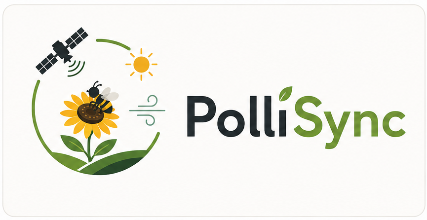
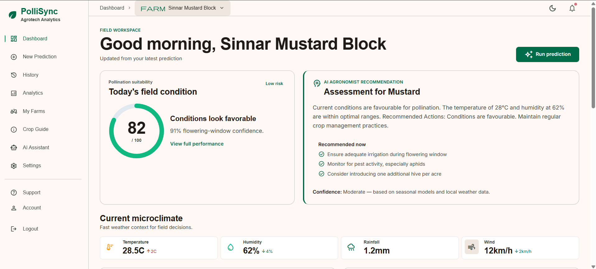

<p align="center">
  
</p>

<h1 align="center">
  PolliSync
</h1>

<p align="center">
  <em>AI-Based Crop Pollination Suitability System</em>
</p>

<p align="center">
  <a href="https://github.com/your-org/polli-sync/blob/main/LICENSE">
    
  </a>
  <a href="https://www.python.org/downloads/">
    
  </a>
  <a href="https://react.dev/">
    
  </a>
</p>

---

## Introduction

PolliSync is an AI-assisted crop pollination suitability system designed for Indian agriculture. It combines farm details, real-time weather data, vegetation health indices, and pollinator observations to:

- **Predict flowering windows** for major crops (Mustard, Wheat, Sunflower, Rice, Cotton)
- **Calculate a Pollination Suitability Index (PSI)** — a 0-100 score with risk level
- **Generate AI-powered recommendations** using LLM for actionable farming advice
- **Visualize pollinator activity** with interactive maps

Built as a student hackathon project, PolliSync uses free-tier APIs and tools to deliver a professional, demo-ready dashboard.



## Table of Contents

* [Features](#features)
* [Quick Start](#quick-start)
  * [Backend](#backend)
  * [Frontend](#frontend)
* [Repository Layout](#repository-layout)
* [Tech Stack](#tech-stack)
* [Validation](#validation)
* [Documentation](#documentation)
* [Contributing](#contributing)
* [License](#license)

## Features

| Feature | Description |
|---------|-------------|
| **Flowering Forecasts** | ML-powered prediction of crop flowering windows based on weather patterns and satellite data |
| **Pollination Suitability Index** | Composite 0-100 score combining temperature, humidity, NDVI, bee activity, and pollen data |
| **AI Recommendations** | LLM-generated actionable advice tailored to specific crop, location, and current conditions |
| **Pollinator Mapping** | Interactive Leaflet map showing nearby bee species from GBIF observations within 10km radius |
| **Real-Time Weather** | Live weather data from Open-Meteo API with 1-hour caching for performance |
| **Responsive Dashboard** | Professional SaaS-style UI with PSI gauge, weather cards, charts, and markdown recommendations |

## Quick Start

### Backend

From the repository root:

```console
python -m venv .venv
.venv\Scripts\python.exe -m pip install -r backend\requirements-dev.txt
cd backend
..\.venv\Scripts\python.exe -m uvicorn app.main:app --reload
```

Open http://localhost:8000/docs for the Swagger UI. The health endpoint is http://localhost:8000/api/health.

### Frontend

In another terminal:

```console
cd frontend
npm install
npm run dev
```

Open http://localhost:5173.

Copy `frontend/.env.example` to `frontend/.env` only when you need to change the local API URL. Copy `backend/.env.example` to `backend/.env` before adding secrets.

## Repository Layout

```
.
├── frontend/          React 18, Vite, and Tailwind web app
├── backend/           FastAPI and SQLite API
├── ml/                Data, notebooks, model artifacts, and ML code
├── docs/              Setup and architecture notes
├── .github/workflows/ Continuous integration
├── .claude/agents/    Reusable repository setup agent
└── docs/PLAYBOOK.md          Engineering playbook
```

## Tech Stack

### Frontend

| Tech | Purpose |
|------|---------|
| React 18 | UI framework |
| Vite | Build tool with instant HMR |
| Tailwind CSS | Utility-first styling |
| Chart.js | Data visualization |
| React-Leaflet | Interactive maps |
| Axios | HTTP client with interceptors |

### Backend

| Tech | Purpose |
|------|---------|
| FastAPI | Async Python API framework |
| SQLAlchemy | ORM for database operations |
| SQLite | Zero-config database |
| Pydantic | Data validation |
| python-jose | JWT authentication |

### ML & AI

| Tech | Purpose |
|------|---------|
| Scikit-learn | Random Forest models |
| XGBoost | Gradient boosting for predictions |
| OpenAI / Groq | LLM-powered recommendations |
| Open-Meteo | Free weather API |
| GBIF | Bee occurrence data |

## Validation

```console
cd frontend
npm run build

cd backend
..\.venv\Scripts\python.exe -m pytest
```

See `docs/SETUP.md` for the complete setup and team workflow.

## Documentation

- [Setup Guide](docs/SETUP.md) — Full installation and team workflow
- [Architecture](docs/ARCHITECTURE.md) — System design and data flow
- [Progress Log](docs/progress.md) — Development progress tracker
- [Engineering Playbook](docs/PLAYBOOK.md) — Complete project plan and task breakdown

## Current Starter Scope

The initial code provides:

- A responsive React landing/status screen
- A central API client boundary for future frontend work
- FastAPI health and farm endpoints
- SQLite persistence with SQLAlchemy
- One backend smoke-test module
- An ML module contract and honest placeholder implementation
- CI checks for frontend builds and backend tests

Authentication, live weather and GBIF integrations, trained model artifacts, and dashboards are intentionally left for the planned project milestones.

## Contributing

This is a student hackathon project by a team of 4 SY CSE-AI students. Contributions, issues, and feature requests are welcome.

1. Fork the repository
2. Create your feature branch (`git checkout -b feature/amazing-feature`)
3. Commit your changes (`git commit -m 'Add amazing feature'`)
4. Push to the branch (`git push origin feature/amazing-feature`)
5. Open a Pull Request

## License

This project is licensed under the MIT License — see the [LICENSE](LICENSE) file for details.

---

<p align="center">
  <sub>Copyright &copy; 2026 <a href="https://github.com/your-org/polli-sync">PolliSync Team</a></sub>
</p>
