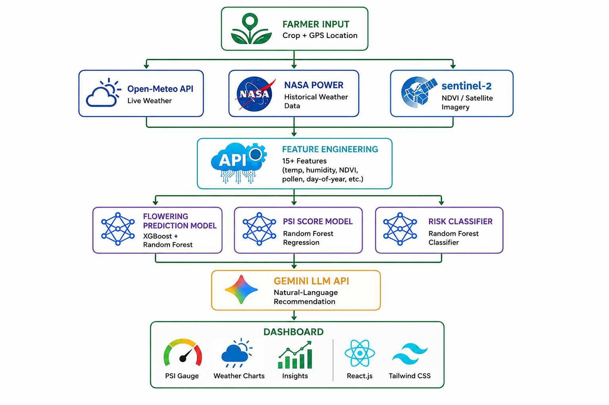

# Architecture

PolliSync is a modular monorepo with a single deployable FastAPI backend. The architecture deliberately avoids microservices, background queues, containers, and managed databases to stay within free-tier constraints while preserving clear module boundaries for future growth.



---

## High-Level Overview

```
+------------------------------------------------------------------+
|                         USER LAYER                                |
|   Browser / Mobile Browser                                        |
+----------------------------+-------------------------------------+
                             | HTTPS
                             v
+------------------------------------------------------------------+
|                      FRONTEND                                     |
|   React 18 + Vite + Tailwind CSS                                  |
|   Pages: Landing | Login | Register | Predict | Dashboard         |
|   State: AuthContext (JWT) + Axios interceptors                   |
+----------------------------+-------------------------------------+
                             | REST API (JSON)
                             v
+------------------------------------------------------------------+
|                      BACKEND (FastAPI)                             |
|                                                                   |
|   app/main.py          Entry point, CORS, lifespan, router mount |
|   app/core/config.py   Environment variables, settings            |
|   app/auth.py          JWT access/refresh tokens, bcrypt           |
|                                                                   |
|   Routes (11 groups under /api):                                  |
|     /api/auth/*        Register, login, logout, me, firebase      |
|     /api/farms/*       Farm CRUD, team members                    |
|     /api/weather/*     Current weather + forecast                  |
|     /api/predictions/* Create prediction, history, dashboard      |
|     /api/recommendations/*  LLM-generated advice                  |
|     /api/maps/*        Bee occurrence map data                    |
|     /api/notifications/*   List, read, preferences                |
|     /api/agent/*       Gemini chat + knowledge search             |
|     /api/health        Health check                               |
|                                                                   |
|   Services (business logic):                                      |
|     weather_service.py     Open-Meteo API + 1-hour cache          |
|     bee_service.py         GBIF API + mock fallback               |
|     environment_service.py NDVI / environmental features          |
|     feature_engineering.py 17 features + 7 interaction terms      |
|     prediction_service.py  Loads .pkl models, runs inference      |
|                                                                   |
|   Models (SQLAlchemy ORM):                                        |
|     User, Farm, Prediction, WeatherCache, BeeOccurrence,          |
|     TeamMember, Notification, NotificationPreference              |
|                                                                   |
|   Agent (AI assistant):                                           |
|     Gemini LLM chat, Supabase vector store, text embeddings       |
+------+------------------+-------------------+--------------------+
       |                  |                   |
       v                  v                   v
+------------+   +----------------+   +--------------------+
|  SQLite    |   |  EXTERNAL APIs |   |  ML MODELS         |
|  Database  |   |  (Free Tier)   |   |  (Pickle Files)    |
|            |   |                |   |                    |
| users      |   | Open-Meteo     |   | flowering_model    |
| farms      |   | (Weather)      |   | psi_model          |
| predictions|   |                |   | risk_model         |
| weather_   |   | GBIF           |   | (+ v2, ensemble,   |
|   cache    |   | (Bee Data)     |   |  quantile variants)|
| bee_       |   |                |   |                    |
|   occur.   |   | Google Gemini  |   | Saved in:          |
| team_      |   | (LLM)         |   | ml/models/*.pkl    |
|   members  |   |                |   |                    |
| notif.     |   | NASA POWER     |   | 24 model files     |
+------------+   +----------------+   +--------------------+
```

---

## Component Breakdown

### Frontend

| Layer | Files | Responsibility |
|-------|-------|---------------|
| **Entry** | `src/main.jsx`, `src/App.jsx` | BrowserRouter, ThemeProvider, AuthProvider, all routes |
| **Pages** | `src/pages/*.jsx` | LandingPage, LoginPage, RegisterPage, PredictPage, DashboardPage |
| **Components** | `src/components/*.jsx` | PSIgauge, WeatherCard, PollenBar, FloweringCalendar, RecommendationCard, NDVICard, BeeMap, ChartWrapper, Layout, LoadingSkeleton, ProtectedRoute, etc. |
| **State** | `src/context/AuthContext.jsx` | Login/logout/register, JWT token in localStorage |
| **API** | `src/lib/api.js` | Axios instance with base URL + Authorization interceptor |
| **Styling** | `tailwind.config.js`, `src/index.css` | Material Design 3 color tokens, Geist Sans + Inter fonts |

The frontend owns all presentation logic and browser state. It communicates with the backend exclusively through REST API calls. No business logic lives in the frontend.

### Backend

The backend follows a layered architecture:

```
Request → Router → Service → External API / Database
              ↓
           Schema (Pydantic validation)
```

**Entry point** (`app/main.py`):
- Creates the FastAPI app with CORS middleware
- Mounts 11 route groups under `/api`
- Runs database initialization on startup (lifespan)
- Configures allowed origins: `localhost:5173` (dev) and `polli-sync-web.vercel.app` (prod)

**Routes** (`app/api/routes/*.py`):
- Thin layer that handles HTTP concerns (request parsing, status codes, response formatting)
- Delegates business logic to services
- 11 route groups covering auth, farms, weather, predictions, recommendations, maps, notifications, agent, and health

**Services** (`app/services/*.py`):
- Core business logic, isolated from HTTP layer
- `weather_service.py` — Fetches from Open-Meteo, caches in SQLite for 1 hour
- `bee_service.py` — Queries GBIF occurrence API, falls back to crop-specific mock data
- `feature_engineering.py` — Builds 17-base + 7-interaction feature vectors for ML models
- `prediction_service.py` — Loads .pkl models from `ml/models/`, runs inference, returns structured predictions
- `environment_service.py` — NDVI estimation via NASA POWER or seasonal lookup

**Models** (`app/models/*.py`):
- SQLAlchemy ORM mapped to SQLite tables
- 8 tables: users, farms, predictions, weather_cache, bee_occurrences, team_members, notifications, notification_preferences

**Schemas** (`app/schemas/*.py`):
- Pydantic models for request/response validation
- One schema file per domain: user, farm, prediction, weather, maps, notification, team_member

**Agent** (`app/agent/`):
- Gemini LLM integration for conversational AI assistant
- Supabase vector store for knowledge-base embeddings
- Template-based prompt construction with variable injection

### ML Pipeline

```
ml/
├── data/              CSV training datasets
├── models/            Serialized .pkl model files (24 files)
├── src/               Training scripts, validation, feature engineering
│   ├── train_improved_models.py    V1 + V2 XGBoost training
│   ├── train_ensemble.py           Stacking ensemble + quantile regression
│   ├── test_regression.py          52 automated regression tests
│   └── comprehensive_validation.py Full validation report
├── notebooks/         Jupyter notebooks for experimentation
└── predict.py         Standalone prediction interface
```

**Models:**

| Model | Algorithm | Purpose | Key Metric |
|-------|-----------|---------|-----------|
| Flowering | XGBoost Regressor | Predicts day-of-year for flowering window | R²=0.9997, MAE=0.6 days |
| PSI | XGBoost Regressor | Predicts Pollination Suitability Index (0-100) | R²=0.988, MAE=2.4 |
| Risk | XGBoost Classifier | Classifies risk level (Low/Medium/High) | 98.4% accuracy |

**Feature Vector (24 dimensions):**

7 base features: `temp_7d_mean`, `humidity`, `rainfall_7d`, `wind_speed`, `ndvi`, `day_of_year`, `month`
5 crop one-hots: `crop_mustard`, `crop_wheat`, `crop_sunflower`, `crop_rice`, `crop_cotton`
3 ecological features: `bee_richness`, `pollen_tree`, `pollen_grass`, `pollen_weed`
7 interaction terms: `temp_humidity`, `temp_ndvi`, `humidity_rainfall`, `bee_pollen`, `ndvi_bee`, `wind_humidity`, `crop_temp`

**Model loading flow:**
1. Backend `prediction_service.py` loads `.pkl` files from `ml/models/` at startup
2. Feature engineering builds a 24-feature vector from weather + bee + environmental data
3. Models run inference (scaler transform → model predict → post-process)
4. Results are structured as JSON and returned to the frontend

---

## Data Flow

### Prediction Pipeline (end-to-end)

```
User selects Crop + Location (lat/lng)
    │
    ▼
┌─────────────────────────────────────────────────────┐
│ Backend receives POST /api/predictions               │
│   { farm_id }                                        │
└─────────────┬───────────────────────────────────────┘
              │
    ┌─────────┴─────────┐
    ▼                   ▼
┌──────────┐    ┌──────────────┐
│ Open-Meteo│    │  GBIF API    │
│ Weather   │    │  Bee Data    │
│ (cached   │    │  (cached     │
│  1 hour)  │    │   1 week)    │
└─────┬────┘    └──────┬───────┘
      │                │
      └────────┬───────┘
               ▼
    ┌──────────────────┐
    │ Feature Engineer  │
    │ 24-dim vector     │
    └────────┬─────────┘
             │
    ┌────────┴────────┐
    ▼                 ▼
┌──────────┐   ┌──────────┐
│Flowering │   │ PSI +    │
│ Model    │   │ Risk     │
│ (XGBoost)│   │ Models   │
└─────┬───┘   └────┬─────┘
      │            │
      └──────┬─────┘
             ▼
    ┌──────────────────┐
    │ Google Gemini     │
    │ LLM generates     │
    │ recommendation    │
    └────────┬─────────┘
             ▼
    ┌──────────────────┐
    │ Response JSON:    │
    │ - flowering window│
    │ - PSI score       │
    │ - risk level      │
    │ - weather summary │
    │ - bee species     │
    │ - NDVI value      │
    │ - AI advice       │
    └──────────────────┘
```

### Authentication Flow

```
Client                          Server
  │                               │
  │  POST /api/auth/register      │
  │  {email, password, name}      │
  │──────────────────────────────>│
  │                               │ bcrypt hash password
  │                               │ store in users table
  │  {access_token, user}         │
  │<──────────────────────────────│
  │                               │
  │  Store token in localStorage  │
  │                               │
  │  GET /api/auth/me             │
  │  Authorization: Bearer <jwt>  │
  │──────────────────────────────>│
  │                               │ decode JWT, fetch user
  │  {id, email, full_name}       │
  │<──────────────────────────────│
```

### Caching Strategy

| Data Source | Cache Location | TTL | Eviction |
|-------------|---------------|-----|----------|
| Open-Meteo weather | SQLite `weather_cache` table | 1 hour | Time-based |
| GBIF bee occurrences | SQLite `bee_occurrences` table | 1 week | Time-based |
| ML model artifacts | In-memory (loaded at startup) | Server lifetime | Reload on restart |
| LLM recommendations | Not cached (generated per prediction) | — | — |

---

## External Integrations

| Service | Purpose | Auth | Free Tier Limits |
|---------|---------|------|-----------------|
| **Open-Meteo** | Weather data (temperature, humidity, rainfall, wind) | None (no API key) | Generous, 10k requests/day |
| **GBIF** | Bee species occurrence data | None (no API key) | Public API, rate-limited |
| **Google Gemini** | LLM-powered recommendations + AI assistant | API key (`GEMINI_API_KEY`) | Free tier available |
| **NASA POWER** | NDVI / vegetation index fallback | None | Public API |
| **Firebase** | Optional Google OAuth authentication | Service account JSON | Free Spark plan |

---

## Database Schema

8 SQLite tables managed by SQLAlchemy ORM. See `backend/app/models/` for column definitions.

```
users ──────────< farms ──────────< predictions
                       │                │
                       │                ├── weather_cache
                       │                └── bee_occurrences
                       │
                       └── team_members

notifications
notification_preferences
```

Key relationships:
- A **user** has many **farms**
- A **farm** has many **predictions**, **weather_cache** entries, and **bee_occurrences**
- **Predictions** store the full result (flowering, PSI, weather, bees, NDVI, recommendation) as a snapshot

See `docs/PLAYBOOK.md` Section 11 for the full SQL DDL.

---

## Deployment Topology

```
┌─────────────────────────────────────────────┐
│                  VERCEL                      │
│   Frontend (React + Vite build)              │
│   URL: polli-sync-web.vercel.app             │
│   Auto-deploys on push to main               │
│   Env: VITE_API_URL=https://polli-sync-...  │
└──────────────────┬──────────────────────────┘
                   │ HTTPS (REST API calls)
                   v
┌─────────────────────────────────────────────┐
│                  RENDER                      │
│   Backend (FastAPI + Uvicorn)                │
│   URL: polli-sync-api.onrender.com           │
│   Auto-deploys on push to main               │
│   Env: SECRET_KEY, GEMINI_API_KEY, etc.      │
│   SQLite: pollisync.db (ephemeral)           │
│   Note: Free tier sleeps after 15min idle    │
│         Cold start ~30 seconds               │
└─────────────────────────────────────────────┘
```

**CI/CD Pipeline** (`.github/workflows/ci.yml`):
- On every push/PR: frontend `npm run build` + backend `pytest`
- Main branch protections require passing CI

---

## Technology Rationale

| Choice | Why This | Why Not Alternatives |
|--------|----------|---------------------|
| **FastAPI** | Auto-generated Swagger docs, async support, Pydantic validation built-in, fast for ML serving | Flask (no auto-docs), Django (heavy for API-only) |
| **SQLite** | Zero config, single file, perfect for MVP, no external dependencies | PostgreSQL (requires hosting), MongoDB (schemaless not needed) |
| **XGBoost** | Best performance on tabular data, fast training, handles mixed feature types | Deep Learning (overkill for 4K rows), RandomForest (lower accuracy) |
| **Direct LLM calls** | Simple to implement, no infrastructure overhead, fast to iterate on prompts | RAG (needs vector DB setup), LangChain (abstraction overhead for simple use case) |
| **React + Vite** | Fast HMR, modern tooling, huge ecosystem, team already knows React | Next.js (SSR not needed for SPA), Vue (team preference) |
| **Tailwind CSS** | Rapid prototyping, consistent design tokens, no CSS files to manage | CSS modules (slower iteration), styled-components (runtime overhead) |
| **Vercel + Render** | Free tiers, auto-deploy from GitHub, minimal configuration | AWS/GCP (expensive, complex), Railway (limited free tier) |

---

## Design Principles

1. **Modular monorepo** — Frontend, backend, and ML are separate directories with clear interfaces, deployed independently.
2. **Free-tier first** — Every external service has a free tier. No paid APIs or hosting for MVP.
3. **Demo-ready at every stage** — The app is functional and presentable after each development sprint.
4. **Module boundaries** — Services are isolated so each team member can work independently without merge conflicts.
5. **Graceful degradation** — If an external API is down or a key is missing, the system falls back to mock/cached data rather than crashing.
